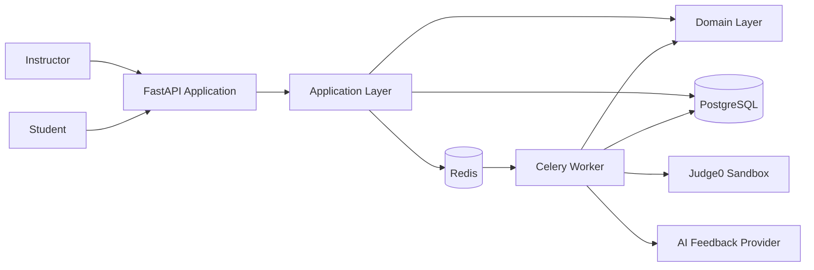
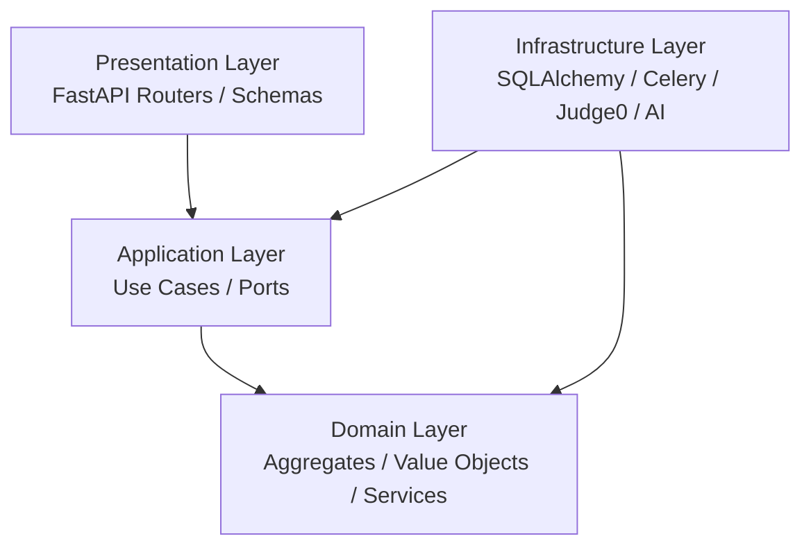
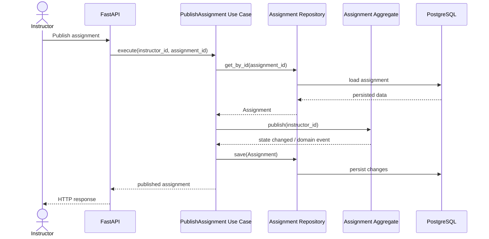
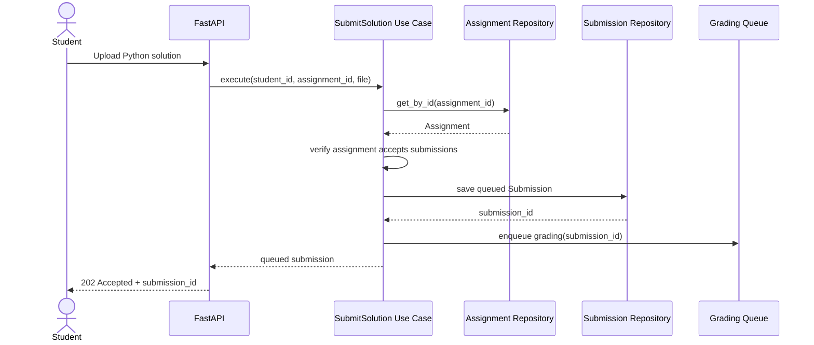
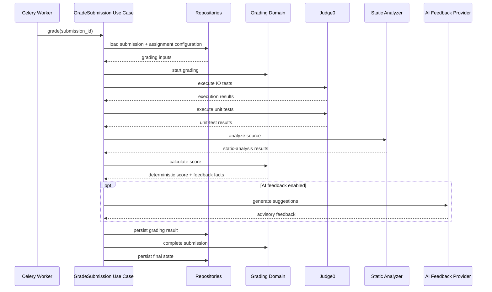
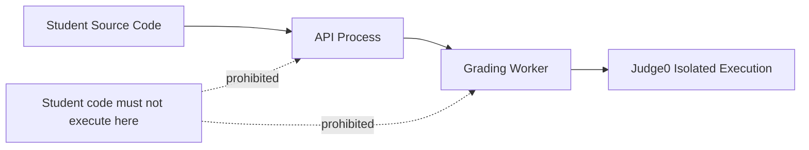

# EdTech Autograder - Architecture

## 1. Architectural Goal

The architecture must support the functional requirements defined for Phase 1 while preserving clear separation between:

- HTTP/API concerns;
- application use cases;
- business rules;
- persistence;
- asynchronous processing;
- untrusted code execution; and
- optional AI-assisted feedback.

The design follows a layered architecture influenced by Domain-Driven Design and ports-and-adapters principles.

The most important dependency rule is:

> The domain layer must not depend on FastAPI, SQLAlchemy, Celery, Redis, Judge0, PostgreSQL, or an AI provider.

Infrastructure may depend on domain/application abstractions, but the reverse dependency is not allowed.

---

## 2. High-Level System Architecture



### Responsibilities

**FastAPI Application**
- accepts HTTP requests;
- validates transport-level request shapes;
- authenticates users;
- invokes application use cases;
- serializes responses.

**Application Layer**
- coordinates use cases;
- manages transaction boundaries;
- invokes domain behaviour;
- calls repository and external-service ports;
- publishes/schedules asynchronous work.

**Domain Layer**
- contains business concepts;
- protects invariants;
- models state transitions;
- calculates deterministic scores;
- remains independent of infrastructure.

**PostgreSQL**
- stores users, assignments, submissions, tests, grading results, and lifecycle state.

**Redis**
- acts as the message broker/backend used by the asynchronous grading workflow.

**Celery Worker**
- executes long-running grading orchestration outside the API request.

**Judge0**
- executes untrusted Python code in an isolated runtime.

**AI Feedback Provider**
- may generate advisory improvement feedback after deterministic grading.

---

## 3. Layered Dependency Model



The arrows represent source-code dependencies.

### Presentation Layer

The presentation layer may know:

- FastAPI;
- request/response schemas;
- authentication dependencies;
- HTTP status codes.

It should not contain core grading rules or direct persistence logic.

### Application Layer

The application layer contains use cases such as:

- `RegisterUser`;
- `AuthenticateUser`;
- `CreateAssignment`;
- `ConfigureAssignment`;
- `PublishAssignment`;
- `SubmitSolution`;
- `GradeSubmission`;
- `GetSubmissionResult`.

It coordinates domain objects and ports but should avoid embedding domain invariants that belong inside the domain model.

### Domain Layer

The domain layer owns rules such as:

- grading weights must total 100 percent;
- only valid submission-state transitions are allowed;
- final scoring is deterministic;
- AI feedback cannot modify the numeric score;
- hidden tests remain confidential in student-facing feedback;
- publication requires a valid assignment configuration.

### Infrastructure Layer

Infrastructure provides concrete adapters for application/domain ports, such as:

- SQLAlchemy repositories;
- PostgreSQL persistence;
- Celery task scheduling;
- Judge0 code execution;
- Redis;
- AI feedback generation.

---

## 4. Proposed Project Structure

The implementation will evolve toward the following structure:

```text
app/
├── main.py
│
├── presentation/
│   ├── api/
│   │   ├── auth.py
│   │   ├── assignments.py
│   │   ├── submissions.py
│   │   └── results.py
│   └── schemas/
│
├── application/
│   ├── auth/
│   ├── assignments/
│   ├── submissions/
│   └── grading/
│
├── domain/
│   ├── identity/
│   ├── assessment/
│   ├── submission/
│   └── grading/
│
└── infrastructure/
    ├── persistence/
    ├── execution/
    ├── messaging/
    └── feedback/
```

The folder structure is secondary to the dependency rules. The architecture is considered successful only if domain code remains isolated from frameworks and infrastructure.

---

## 5. Request Flow - Create and Publish Assignment



The domain aggregate decides whether publication is valid. The HTTP route does not reproduce publication rules.

---

## 6. Request Flow - Student Submission



A submission is persisted before asynchronous grading begins.

This ensures that the submission remains traceable even if queueing or grading infrastructure later fails.

---

## 7. Asynchronous Grading Flow



The deterministic grade is produced before optional AI feedback.

An AI-provider failure must therefore not invalidate an otherwise successful deterministic grading result.

---

## 8. Security Boundary for Student Code



Student source code is data until it reaches the isolated execution adapter.

The application may parse source code for static analysis, but it must not dynamically execute student-controlled Python inside the API or worker process.

---

## 9. Persistence Strategy

PostgreSQL is the system of record for Phase 1.

The persistence model will store data required for:

- user identity and roles;
- assignment ownership and publication state;
- grading configuration;
- IO tests;
- unit-test specifications;
- static-analysis configuration;
- submission attempts;
- submission lifecycle state;
- execution/grading results;
- deterministic scoring;
- permitted feedback;
- optional AI feedback.

SQLAlchemy will be used as the persistence implementation and Alembic will manage schema migrations.

The domain model will not be designed as a direct mirror of SQLAlchemy tables. Repository adapters are responsible for mapping between persistence models and domain objects where required.

---

## 10. Asynchronous Processing Strategy

Submission upload and grading are intentionally separated.

The API should return after:

1. validating the request;
2. validating submission eligibility;
3. persisting the submission;
4. marking it as queued; and
5. scheduling grading.

Celery workers consume grading jobs asynchronously through Redis.

This satisfies the requirement that long-running execution must not block the HTTP request.

---

## 11. External Service Ports

Infrastructure integrations must be accessed through explicit application-facing interfaces.

### Code Execution Port

Conceptual interface:

```text
CodeExecutionGateway
    execute(source_code, stdin, limits)
        -> ExecutionResult
```

Judge0 will implement this port.

### Grading Queue Port

```text
GradingQueue
    enqueue(submission_id)
```

Celery/Redis will implement this port.

### AI Feedback Port

```text
FeedbackAdvisor
    generate(context)
        -> AdvisoryFeedback
```

The concrete AI provider can change without affecting deterministic grading logic.

---

## 12. Failure Strategy

Failures are handled according to their boundary.

### Request/Validation Failure

Examples:
- invalid file type;
- assignment not published;
- unauthorized access.

These fail synchronously before grading is queued.

### Domain Rule Failure

Examples:
- invalid grading weights;
- invalid state transition;
- invalid publication configuration.

These are rejected by the domain model.

### Execution Failure

Examples:
- timeout;
- syntax error;
- runtime error;
- Judge0 error.

These become grading facts or grading failures associated with the persisted submission.

### Optional AI Failure

Failure of AI feedback generation must not alter or discard an already calculated deterministic score.

### Infrastructure Failure

Infrastructure errors must leave enough persisted state to determine that grading did not complete successfully and to support operational diagnosis or retry policy.

---

## 13. Architecture Decisions

| Decision | Reason |
| --- | --- |
| FastAPI for the HTTP layer | Matches the Python backend and provides typed request/response handling |
| PostgreSQL as system of record | Supports relational ownership, assignment configuration, submissions, and results |
| SQLAlchemy + Alembic | Provides persistence mapping and explicit schema migration history |
| Celery + Redis | Keeps grading work outside API request/response lifecycle |
| Judge0 for dynamic execution | Provides a separate execution boundary for untrusted source code |
| Domain layer independent of frameworks | Makes business rules testable without infrastructure |
| Repository abstractions | Prevents application/domain code from depending directly on SQLAlchemy queries |
| AI feedback isolated behind a port | Keeps scoring deterministic and provider-independent |
| Persist before enqueue | Preserves submission traceability |
| Deterministic scoring before AI | Guarantees AI cannot influence numeric grading |

---

## 14. Architecture Constraints

The implementation must preserve the following constraints:

1. FastAPI routers must not calculate grades.
2. FastAPI routers must not own assignment publication invariants.
3. Domain classes must not import SQLAlchemy.
4. Domain classes must not import FastAPI.
5. Domain classes must not import Celery.
6. Domain classes must not call Judge0.
7. Student-controlled Python must not be dynamically executed locally.
8. AI feedback must remain outside deterministic score calculation.
9. Accepted submissions must be persisted before asynchronous processing.
10. Infrastructure adapters must be replaceable without rewriting domain rules.

These constraints will guide the implementation commits that follow.
