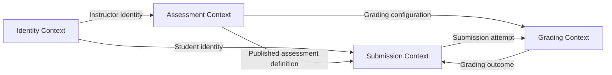
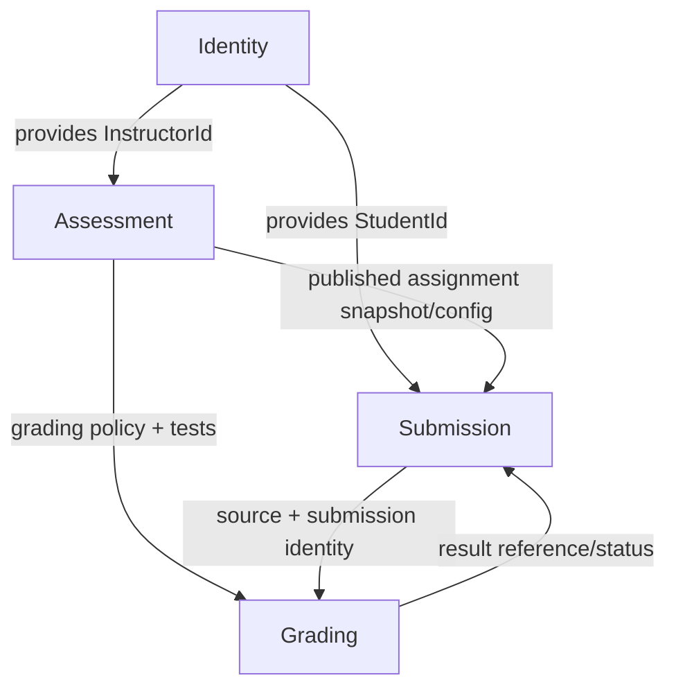
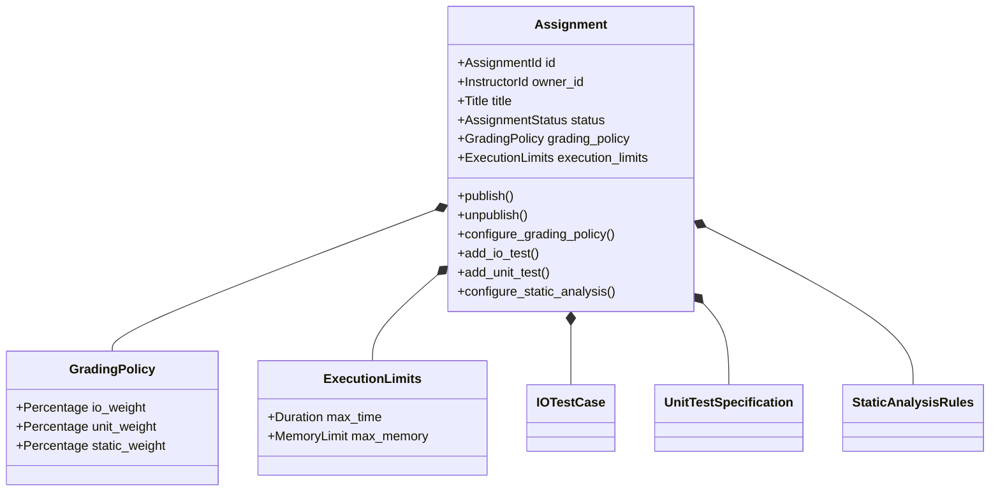
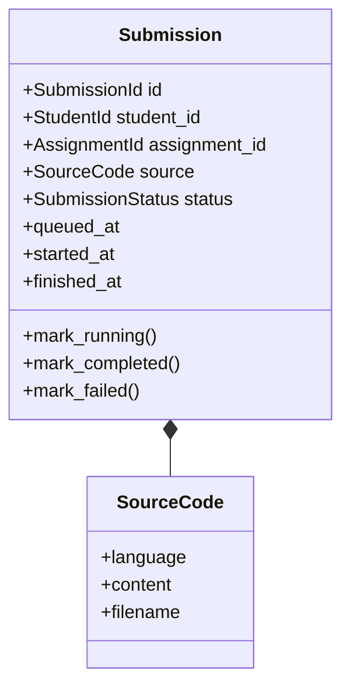
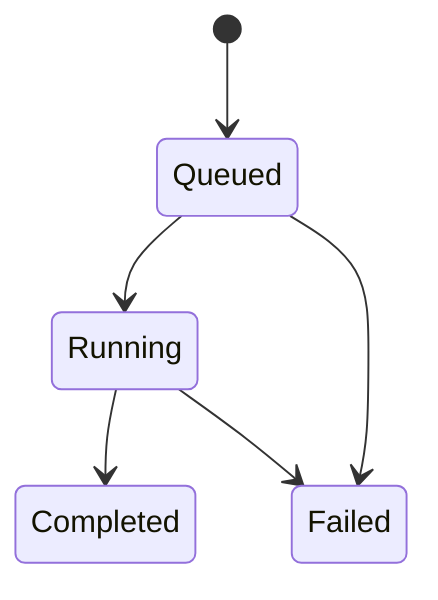
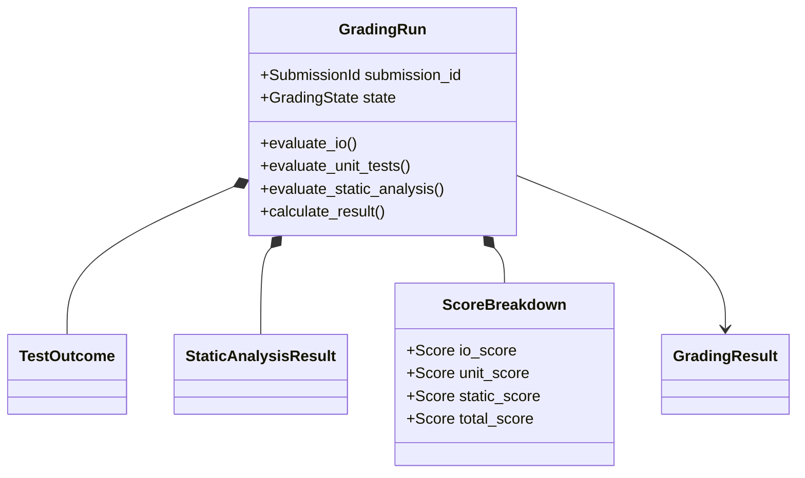
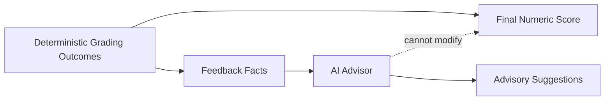

# EdTech Autograder - Domain Design

## 1. Domain Overview

The EdTech Autograder is primarily a system for defining programming assessments and evaluating student submissions against instructor-defined grading rules.

The core business complexity is not user authentication or HTTP transport. It is the relationship between:

- an instructor-authored assessment;
- the grading policy attached to that assessment;
- a student's immutable submission attempt;
- execution and analysis outcomes; and
- a deterministic grading result.

The design therefore separates the system into bounded contexts rather than treating the application as a set of CRUD tables.

---

## 2. Bounded Contexts



### 2.1 Identity Context

**Purpose:** establish authenticated users and roles.

Primary concepts:
- `User`
- `UserId`
- `Email`
- `Role`

This is a supporting context.

It should not contain assignment or grading behaviour.

---

### 2.2 Assessment Context

**Purpose:** allow instructors to define a valid programming assessment and its grading policy.

Primary concepts:
- `Assignment`
- `AssignmentId`
- `GradingPolicy`
- `ExecutionLimits`
- `IOTestCase`
- `UnitTestSpecification`
- `StaticAnalysisRules`
- `TestVisibility`
- `AssignmentStatus`

The `Assignment` aggregate protects configuration and publication rules.

This is part of the core domain.

---

### 2.3 Submission Context

**Purpose:** represent a student's immutable attempt to answer an assignment.

Primary concepts:
- `Submission`
- `SubmissionId`
- `SourceCode`
- `SubmissionStatus`
- `StudentId`
- `AssignmentId`

A new attempt creates a new `Submission`; it does not overwrite a previous attempt.

This is part of the core domain.

---

### 2.4 Grading Context

**Purpose:** evaluate a submission against an assessment configuration and produce a deterministic result.

Primary concepts:
- `GradingRun`
- `GradingResult`
- `Score`
- `ScoreBreakdown`
- `TestOutcome`
- `ExecutionResult`
- `StaticAnalysisResult`
- `FeedbackFact`
- `AdvisoryFeedback`

This is the primary core-domain context because the central business capability is automated evaluation.

---

## 3. Context Map



Contexts communicate using identifiers and explicit contracts rather than sharing ORM models as global objects.

---

## 4. Ubiquitous Language

| Term | Meaning |
| --- | --- |
| Assignment | An instructor-owned programming assessment |
| Published Assignment | An assignment valid for student discovery and submission |
| Grading Policy | The percentage distribution among IO, unit-test, and static-analysis grading |
| Execution Limits | Time and memory constraints for code execution |
| IO Test Case | A grading test defined by input and expected output |
| Unit Test Specification | Instructor-defined assertions used to verify program behaviour |
| Static Analysis Rules | Source-code rules that can be checked without dynamic execution |
| Hidden Test | A grading test whose implementation/input/expected output must not be revealed to students |
| Submission | One immutable student attempt for one assignment |
| Grading Run | The evaluation process for a specific submission |
| Deterministic Score | Numeric result calculated only from defined grading rules and outcomes |
| Score Breakdown | Component-level IO, unit, and static-analysis scores |
| Feedback Fact | Deterministic information derived from grading, such as a timeout or failed rule |
| Advisory Feedback | Optional AI-generated improvement suggestions that cannot change the score |

This vocabulary should be used consistently in code, documentation, tests, and API concepts where practical.

---

## 5. Aggregate: Assignment

`Assignment` is the aggregate root of the Assessment Context.



### Assignment Invariants

The aggregate must protect rules such as:

1. Only the owning instructor may modify assignment configuration.
2. Grading weights must form a complete 100-percent distribution.
3. A published assignment must have a valid grading configuration.
4. Student-facing views must not expose hidden grading definitions.
5. Publishing and unpublishing are explicit state changes rather than arbitrary boolean mutation.

---

## 6. Value Object: GradingPolicy

`GradingPolicy` represents the relative contribution of each grading strategy.

Conceptual form:

```text
GradingPolicy
    io_weight
    unit_weight
    static_weight
```

Invariant:

```text
io_weight + unit_weight + static_weight = 100%
```

Additional constraints:

- no weight may be negative;
- no weight may exceed 100 percent;
- the value object is immutable.

Example:

```text
IO      70%
Unit    20%
Static  10%
        ----
        100%
```

An invalid distribution such as `70/20/20` cannot exist as a valid `GradingPolicy`.

This rule belongs in the domain model rather than only in an API schema or database constraint.

---

## 7. Value Object: ExecutionLimits

`ExecutionLimits` captures sandbox resource constraints for an assignment.

Conceptual form:

```text
ExecutionLimits
    max_execution_seconds
    max_memory_kb
```

Invariants include:

- execution time must be positive;
- memory limit must be positive;
- values must remain within system-supported safety bounds.

The domain represents the policy; the Judge0 adapter translates it into provider-specific request fields.

---

## 8. Aggregate: Submission

`Submission` is the aggregate root of the Submission Context.



A submission is an attempt, not the student's continuously editable answer.

If the student submits again, the system creates another submission with another identifier.

---

## 9. Submission State Machine



Valid transitions:

```text
queued  -> running
queued  -> failed
running -> completed
running -> failed
```

Invalid transitions include:

```text
completed -> running
completed -> queued
failed    -> completed
```

unless a future explicit retry concept is introduced.

The lifecycle should be protected by domain behaviour rather than unrestricted assignment to a status string.

---

## 10. Aggregate: GradingRun

A `GradingRun` represents the evaluation of one submission.



The aggregate/domain service must ensure that the final numeric result comes only from deterministic grading facts.

AI advisory text is not an input to scoring.

---

## 11. Domain Service: Score Calculation

Score calculation is a domain concern because it represents the central grading rule.

Conceptually:

```text
raw IO outcomes
        +
raw unit-test outcomes
        +
raw static-analysis outcomes
        |
        v
component performance
        |
        v
GradingPolicy
        |
        v
ScoreBreakdown
        |
        v
Final deterministic score
```

A conceptual formula is:

```text
final_score =
    normalized_io_score     * io_weight
  + normalized_unit_score   * unit_weight
  + normalized_static_score * static_weight
```

where each weight is represented as a percentage/fraction by the domain value object.

The exact implementation will be written and tested in a later commit.

---

## 12. Hidden-Test Confidentiality

Hidden-test confidentiality is a domain/application rule, not merely presentation formatting.

A test result may contain internal information such as:

- supplied stdin;
- expected output;
- assertion source;
- instructor-only test code.

The system must derive a separate student-safe representation.

Conceptually:

```text
Internal TestOutcome
        |
        v
Visibility Policy
        |
        +---- visible test ----> detailed feedback
        |
        +---- hidden test -----> sanitized feedback
```

This prevents accidental leakage if a route simply serializes a persistence object.

---

## 13. AI Feedback Boundary

AI-generated feedback is deliberately outside deterministic grading.



The AI provider receives already-derived context and may return suggestions.

It cannot:

- change test outcomes;
- award points;
- remove points;
- override the grading policy;
- modify the deterministic score.

---

## 14. Repository Ports

Repositories are expressed in domain/application terms rather than SQLAlchemy terms.

Conceptual ports include:

```text
UserRepository
    get_by_id(user_id)
    get_by_email(email)
    save(user)

AssignmentRepository
    get_by_id(assignment_id)
    save(assignment)
    list_published()

SubmissionRepository
    get_by_id(submission_id)
    save(submission)
    list_by_student(student_id)

GradingResultRepository
    get_by_submission_id(submission_id)
    save(result)
```

The infrastructure layer later provides SQLAlchemy implementations.

Domain/application code should not call:

```text
db.query(...)
db.add(...)
db.commit(...)
```

directly.

---

## 15. External-Service Ports

The application layer requires infrastructure capabilities without depending on concrete vendors.

### Code Execution

```text
CodeExecutionGateway
```

Input:
- source code;
- stdin or test harness;
- execution limits.

Output:
- stdout;
- stderr;
- exit status;
- execution metadata.

Judge0 will be the initial adapter.

### Grading Queue

```text
GradingQueue
```

Responsibility:
- schedule grading for a persisted submission.

Celery/Redis will be the initial adapter.

### Feedback Advisor

```text
FeedbackAdvisor
```

Responsibility:
- produce optional advisory improvement suggestions.

The domain does not know which AI provider implements this contract.

---

## 16. Domain Events

Domain events provide names for meaningful business occurrences.

Potential Phase 1 events:

```text
AssignmentCreated
AssignmentPublished
AssignmentUnpublished
SubmissionQueued
GradingStarted
GradingCompleted
GradingFailed
```

These events describe completed domain facts.

For example:

```text
SubmissionQueued(submission_id)
```

may be used by the application layer to request asynchronous grading.

The first implementation does not require a full event bus. The important design principle is to model meaningful business transitions explicitly.

---

## 17. Business Rule Mapping

| Business Rule | Domain Owner |
| --- | --- |
| BR-01 Assignment ownership | Assessment Context / Assignment |
| BR-02 Published assignment visibility | Assessment Context + application query |
| BR-03 Submission eligibility | Assessment + Submission application use case |
| BR-04 Complete grading distribution | `GradingPolicy` value object |
| BR-05 Score determinism | Grading Context |
| BR-06 Hidden-test confidentiality | Grading Context visibility policy |
| BR-07 Traceable submission lifecycle | Submission Context |
| BR-08 Untrusted code isolation | Application/infrastructure boundary |
| BR-09 Result ownership | Submission Context + application authorization |
| BR-10 Historical attempts | Submission aggregate/repository model |

---

## 18. Entities vs Value Objects

### Entities

Entities have identity that remains meaningful over time.

Phase 1 entities include:

- `User`;
- `Assignment`;
- `IOTestCase`;
- `UnitTestSpecification`;
- `Submission`;
- `GradingRun` / persisted grading result where identity is required.

### Value Objects

Value objects are defined by their values rather than an independent identity.

Likely Phase 1 value objects include:

- `Email`;
- `GradingPolicy`;
- `ExecutionLimits`;
- `SourceCode`;
- `Score`;
- `ScoreBreakdown`;
- `ExecutionResult`;
- `StaticAnalysisResult` where persistence identity is unnecessary.

The final implementation may refine these boundaries as behaviour becomes concrete.

---

## 19. Aggregate Boundary Principles

Aggregate boundaries should remain small.

### Assignment Aggregate

Owns:
- assignment state;
- grading configuration;
- publication invariants.

Does not own:
- every student submission;
- grading results.

### Submission Aggregate

Owns:
- one attempt;
- source code/reference;
- lifecycle transitions.

Does not own:
- the complete assignment object;
- every grading test definition.

### Grading Result / Run

Owns:
- grading outcome for one submission;
- component outcomes;
- deterministic score.

This avoids loading a single massive object graph containing an assignment, all submissions, all students, and all results.

---

## 20. DDD Implementation Rules

The following rules will guide implementation:

1. Domain objects must expose behaviour, not only public mutable fields.
2. Invalid domain states should be difficult or impossible to construct.
3. Domain invariants belong in domain code even when also enforced by API or database validation.
4. Application services coordinate; they do not replace aggregate behaviour.
5. Repository interfaces use domain language.
6. Infrastructure-specific models must not become the application's universal domain model.
7. External services are accessed through ports.
8. State changes such as publishing, queueing, starting, completing, and failing must be explicit.
9. Deterministic grading must remain independent of AI feedback.
10. Tests should target domain rules directly without requiring PostgreSQL, Redis, Celery, or Judge0.

---

## 21. Implementation Order Derived from the Domain

The design suggests the following implementation sequence:

```text
Identity foundation
        |
        v
Assessment domain
        |
        v
Assignment persistence
        |
        v
Submission domain
        |
        v
Submission persistence
        |
        v
Grading domain
        |
        v
Execution adapter
        |
        v
Async worker
        |
        v
Results / feedback
```

This sequence will be implemented through small commits rather than introducing the entire architecture at once.
